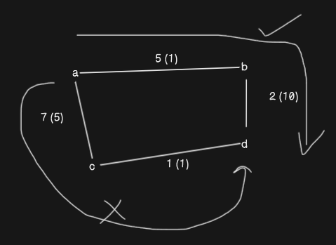

## Path Finding API

### endpoints :

- `/location`
    - request - POST
        ```
            {
                "name":"location f",
                "latitude":32.7749,
                "longitude":-125.4194
            }    
        ```
    - response 
        ```
            {
                "success": true,
                "message": "location created",
                "location": {
                    "name": "location f",
                    "latitude": 32.7749,
                    "longitude": -125.4194,
                    "_id": "66acb733c3ebe3c7e6e6f91d",
                    "createdAt": "2024-08-02T10:38:43.459Z",
                    "updatedAt": "2024-08-02T10:38:43.459Z",
                    "__v": 0
                }
            }
        ```

- `/roads`
    - request - POST
        ```
            {
                "start_location_id": "66acb722c3ebe3c7e6e6f917",
                "end_location_id": "66acb728c3ebe3c7e6e6f919",
                "distance": 1,
                "traffic_condition": "clear"
            }    
        ```
    - response 
        ```
            {
                "success": true,
                "message": "road created",
                "location": {
                    "start_location_id": "66acb722c3ebe3c7e6e6f917",
                    "end_location_id": "66acb728c3ebe3c7e6e6f919",
                    "distance": 1,
                    "traffic_condition": 1,
                    "_id": "66acb84ec3ebe3c7e6e6f92b",
                    "createdAt": "2024-08-02T10:43:26.606Z",
                    "updatedAt": "2024-08-02T10:43:26.606Z",
                    "__v": 0
                }
            }
        ```

- `/roads/traffic-updates`
    - request - POST
        ```
            {
                "road_id":"66aca80c963d7fc2cc9d6b7b",
                "timestamp":"2024-06-25T14:00:00Z",
                "traffic_condition":"heavy"
            }   
        ```
    - response 
        ```
            {
                "success": true,
                "message": "traffic conditions updated successfully",
                "data": {
                    "road_id": "66aca80c963d7fc2cc9d6b7b",
                    "timestamp": "2024-06-25T14:00:00Z",
                    "traffic_condition": "heavy",
                    "_id": "66acae4f85095cd6983fd35b",
                    "createdAt": "2024-08-02T10:00:47.044Z",
                    "updatedAt": "2024-08-02T10:00:47.044Z",
                    "__v": 0
                }
            }
        ```

- `/roads/66aca80c963d7fc2cc9d6b7b/traffic-condition`
    - request - GET   

    - response 
        ```
            {
                "success": true,
                "message": "traffic conditions fetched successfully.",
                "data": [
                    {
                        "_id": "66acae4f85095cd6983fd35b",
                        "road_id": "66aca80c963d7fc2cc9d6b7b",
                        "timestamp": "2024-06-25T14:00:00Z",
                        "traffic_condition": "heavy",
                        "createdAt": "2024-08-02T10:00:47.044Z",
                        "updatedAt": "2024-08-02T10:00:47.044Z",
                        "__v": 0
                    }
                ]
            }
        ```

- `/roads/shortest-path?start_location_id=66aca54aed6d28b3d4964ea9&end_location_id=66acb728c3ebe3c7e6e6f919`
    - request - GET   

    - response 
        ```
            {
                "success": true,
                "message": "path found successfully.",
                "data": {
                    "path": [
                        "66aca54aed6d28b3d4964ea9",
                        "66aca7a756e5000d83e2e64d",
                        "66acb728c3ebe3c7e6e6f919"
                    ],
                    "total_distance": 7,
                    "estimated_time": 25
                }
            }
        ```


### shortest path algorightm : 
    it basically uses dijkstra algorigthm to find the shortest path.
    path is choosen based on time taken to completetly travserse that road.
    I have choosen that value to be distance * traffic_condition.
    I am treating traffic_conditions as an multiplicative index to calculate estimated_time.
    
    - id : 66aca54aed6d28b3d4964ea9 , name: "location a"
    - id : 66aca7a756e5000d83e2e64d , name : "location b"
    - id : 66acb722c3ebe3c7e6e6f917 , name : "location c"
    - id : 66acb728c3ebe3c7e6e6f919 , name : "location d"

    the above example is based on the below image

    
    